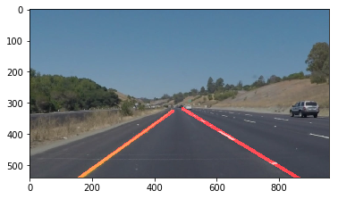

# **Finding Lane Lines on the Road** 

## Writeup Template

### You can use this file as a template for your writeup if you want to submit it as a markdown file. But feel free to use some other method and submit a pdf if you prefer.

---

**Finding Lane Lines on the Road**

The goals / steps of this project are the following:
* Make a pipeline that finds lane lines on the road
* Reflect on your work in a written report

[//]: # (Image References)

---

### Reflection

### 1. Describe your pipeline. As part of the description, explain how you modified the draw_lines() function.

I started off by getting the pipeline to work for a single image, and then I wrapped that image in a function so it could be used by the video pipeline.

The pipeline itself was taking exactly what we learned from class. Each technique we learned fed into the newer technique. There was a bit more trial and error than the quizes, but it was informative.

I used the hint offered for line extrapolation by finding the slope of each line and classifying it as: horizontal, left, or right. I discarded all horizontal lines. Once the left and right lanes were identified I used `np.polyfit` and `np.linspace` to fit a line amongst each. I found new X and Y coordinates, and used the smallest point for X1 and Y2, and the largest point for X2 and Y2, which then became the line to fit over the lane markers.

### 2. Shortcoming and improvements:

There are a few shortcomings I can think of:
  - If a lane isn't found for a frame then no line is drawn. This causes the red line to sometimes disappear and reappear. One solution would be to cache the previous line drawn and reuse it.
  - I filtered out horizontal lines in the line drawing function. Ideally they wouldn't be detected before they get to line drawing.
  - The challenge video was completely wrong. The largest issue I saw was because of the guardrail. I could try narrowing the masked image. I also had the thought of using the hough space to look for perpendicular lines that are a certain space apart and removing them. I could try removing lines that fall outside some standard deviation in the draw lines function as well.
  - The lines on the video look jumpy. I could apply some smoothing over a period of time to prevent jitter.
  - The top of the lines overshoot the lane they're highlighting. I could consider larger smaller (left) and larger (right) X values with calculating the linear space.